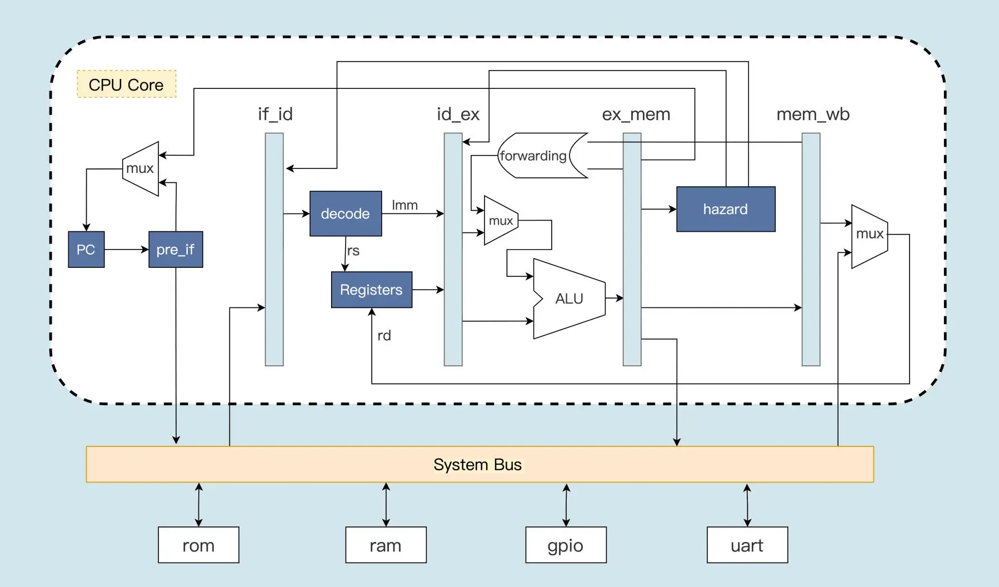
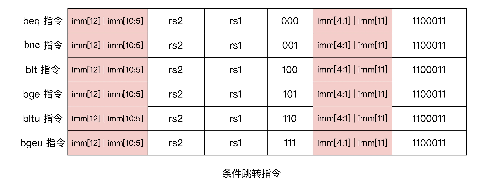

#  手写一个基于RISC-V的Mini CPU

- 此项目是合肥工业大学宣城校区2022年硬件综合设计的项目。

    

## 整体框架



- `pre_if`模块：分支预测（预读取模块），先对上一个指令进行预处理，判断是不是分支跳转指令。如果是跳转指令，则产生跳转后的 PC 值，并对下一条指令进行预读取。

- `if_id`模块：取指通路模块，是取指到译码之间的模块，上面的指令预读取之后就会首先送入 if_id 模块，如果当前流水线没有发出指令清除信号，if_id 模块就会把指令送到译码模块。

- `id_ex`模块：译码到执行之间的模块，用于将完成指令译码之后的寄存器索引值，以及指令执行的功能信息，根据流水线控制模块的控制信号，选择性地发送给执行模块去执行。

- `ex_mem`模块：负责指令执行之后将数据写入存储器中或者从存储器中读出数据的过程。

- `mem_wb`模块：将指令执行的运算结果或者从存储器读出的数据，写回到通用寄存器。

  

## PC寄存器

  PC寄存器模块所在的源文件：rtl/pc_reg.v

  PC寄存器模块的输入输出信号如下表所示：

  | **序号** |          **信号名**          | **输入/输出** | **位宽(bits)** |          **说明**          |
  | :------: | :--------------------------: | :-----------: | :------------: | :------------------------: |
  |    1     |             clk              |     输入      |       1        |        时钟输入信号        |
  |    2     |            reset             |     输入      |       1        |        复位输入信号        |
  |    3     |        hazard_pcStall        |     输入      |       1        |      流水线是否要停顿      |
  |    4     |            pre_pc            |     输入      |       32       |   预测的下一条指令的地址   |
  |    5     | id_ex_ctrl_data_ex_ctrl_jump |     输入      |       2        |                            |
  |    6     |             pc_o             |     输出      |       32       | PC寄存器值，即从该值处取指 |

  

## 指令预读取pre_if

  ```verilog
  /**
  * 分支预测或者预读取模块
  * 不管指令是否跳转，都提前把跳转之后的下一条指令从存储器中读取出来，以备流水线的下一阶段使用，这就提高了 CPU 的执行效率。
  * 输入：当前pc的值和指令的内容
  * 输出：预测的下一条指令的地址
  */
  module pre_if (
      input [31:0] instr,
      input [31:0] pc,
  
      output [31:0] pre_pc
  );
  
      // 根据指令的低7位操作码，判断是否是条件跳转指令或者是无条件跳转指令
      // 条件跳转指令的操作码，也就是指令中的低 7 位数都是 7’b1100011
      wire is_bxx = (instr[6:0] == `OPCODE_BRANCH);   // 条件挑转指令的操作码
      wire is_jal = (instr[6:0] == `OPCODE_JAL) ;     // 无条件跳转指令的操作码
      
      // 根据条件跳转指令的格式，对指令中的立即数进行拼接，为指令跳转时的 PC 提供偏移量。
      //B型指令的立即数拼接
      wire [31:0] bimm  = {{20{instr[31]}}, instr[7], instr[30:25], instr[11:8], 1'b0};
      //J型指令的立即数拼接
      wire [31:0] jimm  = {{12{instr[31]}}, instr[19:12], instr[20], instr[30:21], 1'b0};
  
      //指令地址的偏移量
      // 预读取电路会根据当前的 PC 值和指令的偏移量相加，得到预测的 PC 值
      wire [31:0] adder = is_jal ? jimm : (is_bxx & bimm[31]) ? bimm : 4;
      assign pre_pc = pc + adder;
  endmodule
  ```



条件跳转指令的操作码，也就是指令中的低 7 位数都是 7’b1100011。根据这一特点，我们就可以在指令解码之前，判断出接下来可能会发生跳转。条件跳转指令执行时是否发生跳转，要根据相关的数据来判断，这就需要指令执行之后才能知道是否需要跳转。但是，我们的 CPU 是多级流水线架构，一条指令执行需要多个时钟周期。如果要等到跳转指令执行完成之后再去取下一条指令，就会降低我们的指令执行效率。而指令预读取模块刚好可以解决这个问题。不管指令是否跳转，都提前把跳转之后的下一条指令从存储器中读取出来，以备流水线的下一阶段使用，这就提高了 CPU 的执行效率。

同样地，无条件跳转指令也用这种方式进行预处理。如下图的 jal 跳转指令的格式，它的操作码为 7’b1101111。


最后，预读取电路会根据当前的 PC 值和指令的偏移量相加，得到预测的 PC 值。


## 取指数据通路模块

取指通路模块 if_id 主要产生 3 个信号。首先是给后面解码模块提供的指令信号 reg_instr。如果流水线没有发生冲突，也就是没有发出清除信号 flush，则把预读取的指令保存，否则把指令清“0”。第二个是更新 PC 值，如果指令清除信号 flush=“0”，则把当前指令对应的 PC 值保存为 reg_pc，否则就把 reg_pc 清“0”。最后一个是流水线冲刷的标志信号 reg_noflush。当需要进行流水线冲刷时，reg_noflush=“0”，否则 reg_noflush=“1”。

