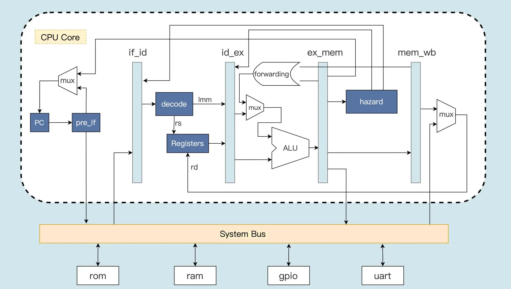

#  手写一个基于RISC-V的Mini CPU

- 此项目是合肥工业大学宣城校区2022年硬件综合设计的项目。

    

## 整体框架

- `pre_if`模块：分支预测（预读取模块），先对上一个指令进行预处理，判断是不是分支跳转指令。如果是跳转指令，则产生跳转后的 PC 值，并对下一条指令进行预读取。
- `if_id`模块：取指通路模块，是取指到译码之间的模块，上面的指令预读取之后就会首先送入 if_id 模块，如果当前流水线没有发出指令清除信号，if_id 模块就会把指令送到译码模块。
- `id_ex`模块：译码到执行之间的模块，用于将完成指令译码之后的寄存器索引值，以及指令执行的功能信息，根据流水线控制模块的控制信号，选择性地发送给执行模块去执行。
- `ex_mem`模块：负责指令执行之后将数据写入存储器中或者从存储器中读出数据的过程。
- `mem_wb`模块：将指令执行的运算结果或者从存储器读出的数据，写回到通用寄存器。

# 文件

- src文件夹下面是工程文件。
  - rtl文件夹下是CPU的各个模块
  - sim文件夹下是测试时的汇编程序代码存放路径以及中间生成的文件
  - tb文件夹下是testbench文件
  - Makefile是自动化测试文件

